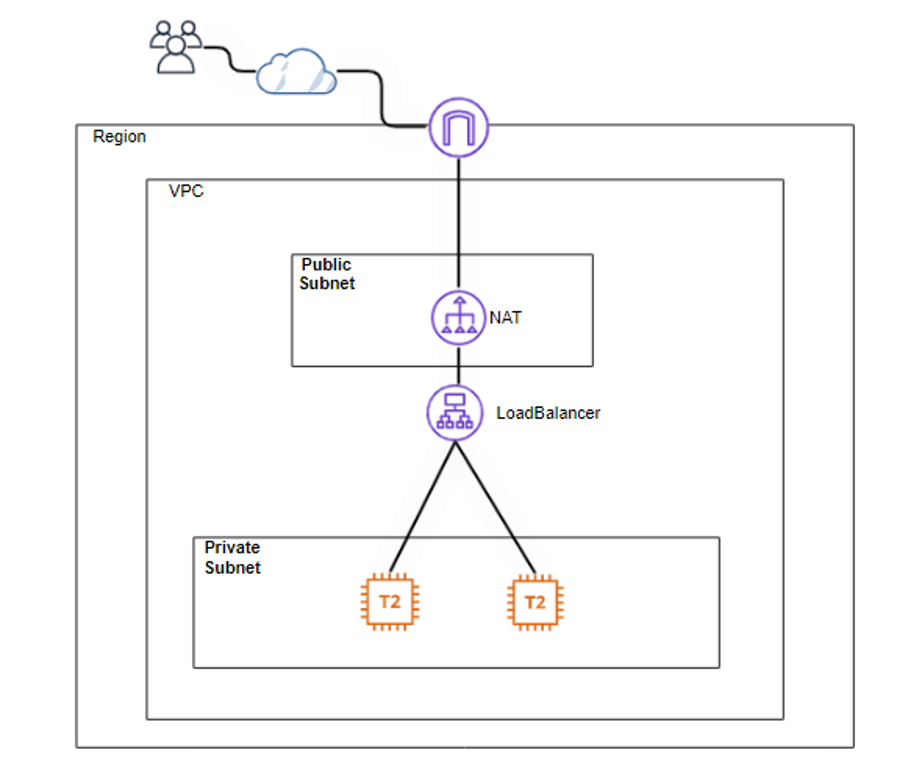
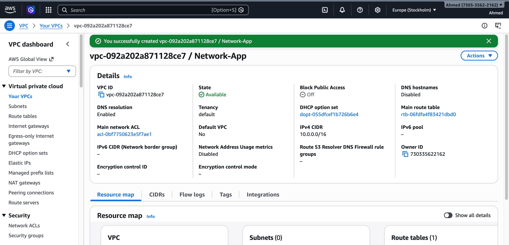
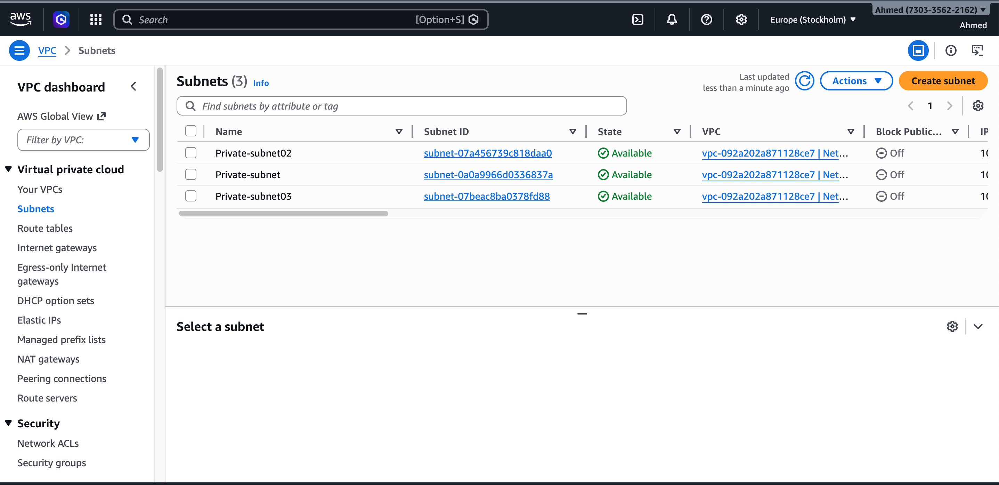
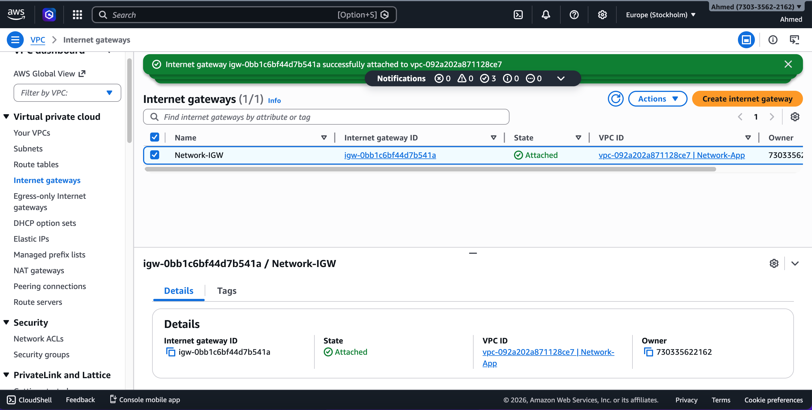
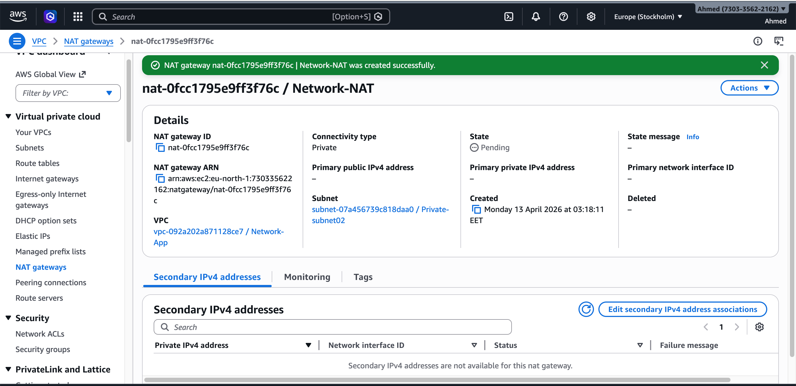
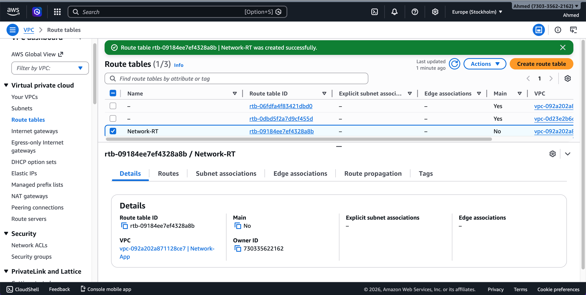
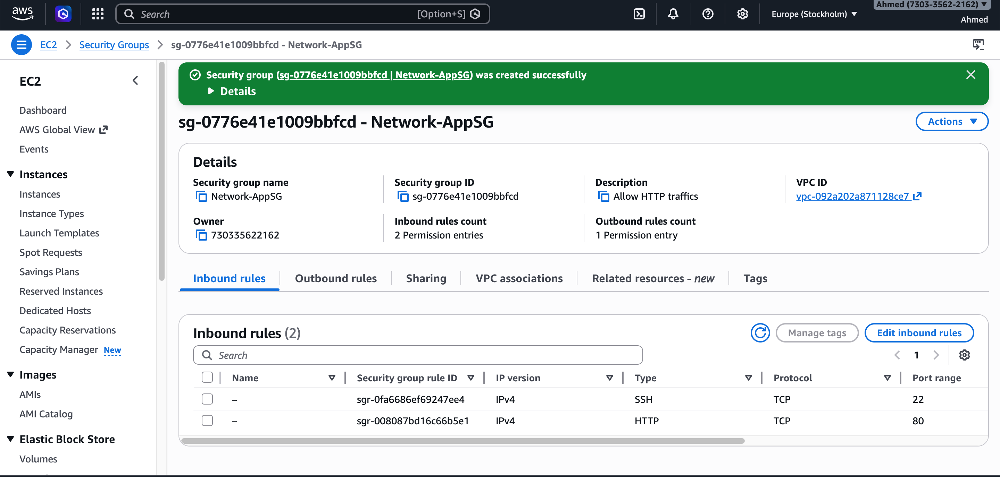
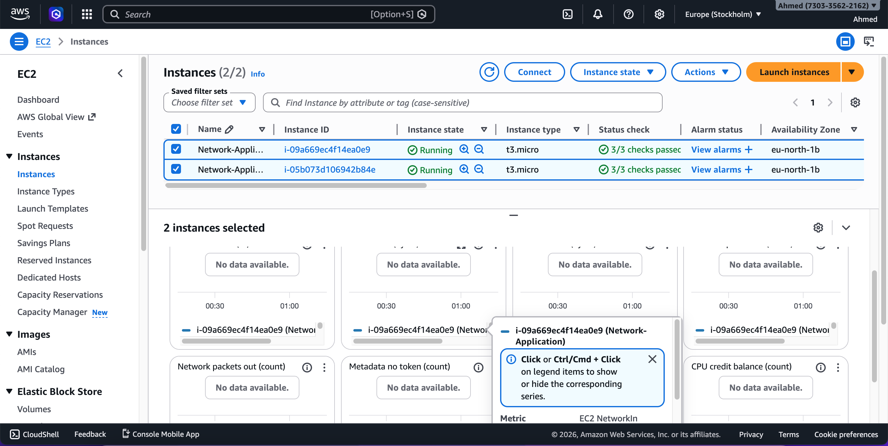
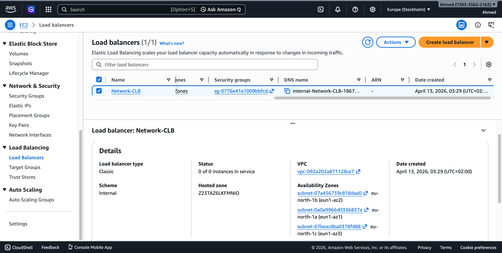

# Secure-VPC-Deployment
A secure AWS network architecture built using VPC, subnets, Internet Gateway, NAT Gateway, route tables, and EC2 instances behind a Load Balancer. Designed to separate public and private resources, ensure controlled internet access, and follow best practices for security, scalability, and availability.

  

### 🏗️ Architecture Overview
The diagram illustrates a secure AWS network design where traffic flows from the internet through an Internet Gateway to a Load Balancer, then to EC2 instances inside private subnets. NAT Gateway enables outbound internet access for private resources.

  

### 🌐 VPC Configuration
A custom VPC is created with CIDR block 10.0.0.0/16, forming the isolated network environment for all resources. It ensures complete control over IP addressing and network segmentation.

  

### 🌍 Subnets
Multiple private subnets are configured across Availability Zones to host application servers securely. These subnets do not allow direct internet access, improving security.

  

### 🌐 Internet Gateway (IGW)
The Internet Gateway enables communication between the VPC and the public internet. It is attached to the VPC and used by public resources.

  

### 🔁 NAT Gateway
The NAT Gateway allows instances in private subnets to access the internet for updates and external services without exposing them to inbound traffic.

  

### 🧭 Route Tables
Custom route tables control traffic flow:
- Public routes → IGW
- Private routes → NAT Gateway

  

### 🔐 Security Groups
Security groups define inbound/outbound rules:
- Allow HTTP (80)
- Allow SSH (22)
Ensuring controlled access to EC2 instances.

  

### 💻 EC2 Instances
Two EC2 instances are deployed in private subnets to run the application. They are not directly accessible from the internet.

  

### ⚖️ Load Balancer
A Load Balancer distributes incoming traffic across EC2 instances, improving availability and fault tolerance.

<h1>## 📖 Case Study</h1>

### 🎯 Problem
Directly exposing servers to the internet increases security risks and reduces control over network traffic.

---

### 💡 Solution
Implemented a secure AWS network architecture:
- Public subnet → Load Balancer
- Private subnets → EC2 instances
- NAT Gateway for outbound access

---

### 🏗️ Architecture Design
- VPC with CIDR 10.0.0.0/16
- Internet Gateway for public access
- NAT Gateway for private subnet internet access
- Route tables for traffic control

---

### 🔐 Security Approach
- EC2 instances isolated in private subnets
- Controlled inbound access via Security Groups
- No direct public IPs on application servers

---

### 🚀 Outcome
- Improved security posture
- Controlled network traffic
- Scalable and production-ready architecture
- Follows AWS best practices

<h2>## 📚 AWS Documentation

https://docs.aws.amazon.com/vpc/latest/userguide/what-is-amazon-vpc.html  
https://docs.aws.amazon.com/vpc/latest/userguide/VPC_Internet_Gateway.html  
https://docs.aws.amazon.com/vpc/latest/userguide/vpc-nat-gateway.html  
https://docs.aws.amazon.com/vpc/latest/userguide/VPC_Route_Tables.html  
https://docs.aws.amazon.com/vpc/latest/userguide/VPC_SecurityGroups.html  
https://docs.aws.amazon.com/ec2/  
https://docs.aws.amazon.com/elasticloadbalancing/  </h2>
